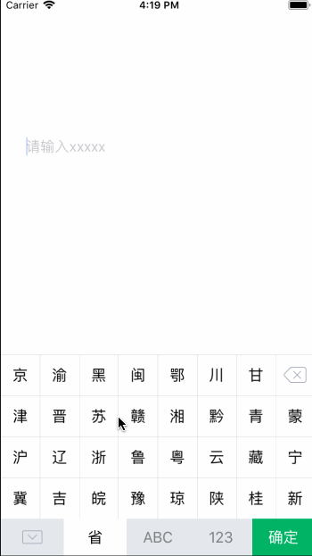

# ZZZkeyboard
###一款自定义的用于输入车牌号码的键盘

  


### 使用

```objective-c
    ZZZKeyboard *keyboard = [[ZZZKeyboard alloc]initWithFrame:CGRectMake(0, 0, 375, 240)];
    UITextField *textField = [[UITextField alloc]initWithFrame:CGRectMake(30, 30, 300, 300)];

    textField.placeholder = @"请输入xxxxx";
    textField.inputView = keyboard;
```

